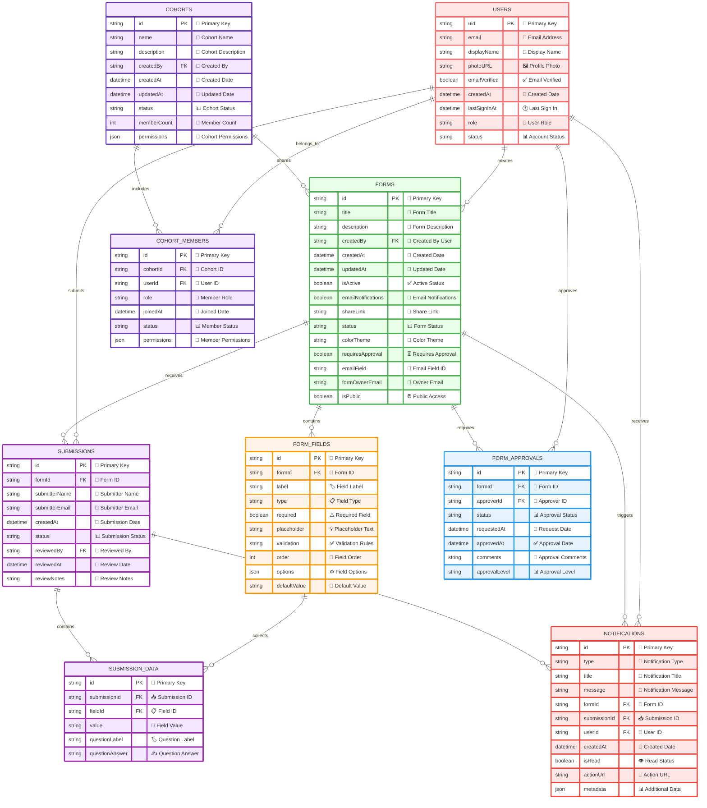

# FormFlow - Entity Relationship Diagram

## 🏗️ Database Schema Overview

### 🔐 **Core Entities**

#### **USERS** - User Management
- **Primary Key**: `uid` (Firebase Auth UID)
- **Core Fields**: email, displayName, photoURL, emailVerified
- **Timestamps**: createdAt, lastSignInAt
- **Status**: role, status

#### **FORMS** - Form Management
- **Primary Key**: `id` (Auto-generated)
- **Core Fields**: title, description, createdBy, status
- **Settings**: isActive, emailNotifications, requiresApproval
- **Access Control**: isPublic, shareLink
- **Timestamps**: createdAt, updatedAt

#### **FORM_FIELDS** - Question Structure
- **Primary Key**: `id` (Auto-generated)
- **Foreign Key**: `formId` → FORMS.id
- **Core Fields**: label, type, required, order
- **Configuration**: validation, options, defaultValue

#### **SUBMISSIONS** - Form Responses
- **Primary Key**: `id` (Auto-generated)
- **Foreign Keys**: `formId` → FORMS.id, `reviewedBy` → USERS.uid
- **Core Fields**: submitterName, submitterEmail, status
- **Timestamps**: createdAt, reviewedAt

#### **SUBMISSION_DATA** - Individual Responses
- **Primary Key**: `id` (Auto-generated)
- **Foreign Keys**: `submissionId` → SUBMISSIONS.id, `fieldId` → FORM_FIELDS.id
- **Data**: value, questionLabel, questionAnswer

#### **NOTIFICATIONS** - System Alerts
- **Primary Key**: `id` (Auto-generated)
- **Foreign Keys**: `formId`, `submissionId`, `userId`
- **Core Fields**: type, title, message, isRead
- **Metadata**: actionUrl, additional data

### 🔄 **Coming Soon Entities**

#### **COHORTS** - User Grouping
- **Primary Key**: `id` (Auto-generated)
- **Foreign Key**: `createdBy` → USERS.uid
- **Core Fields**: name, description, status, memberCount
- **Features**: permissions, member management

#### **COHORT_MEMBERS** - Cohort Membership
- **Primary Key**: `id` (Auto-generated)
- **Foreign Keys**: `cohortId` → COHORTS.id, `userId` → USERS.uid
- **Core Fields**: role, status, permissions

#### **FORM_APPROVALS** - Approval Workflow
- **Primary Key**: `id` (Auto-generated)
- **Foreign Keys**: `formId` → FORMS.id, `approverId` → USERS.uid
- **Core Fields**: status, approvalLevel, comments

### 🎨 **Color Coding**
- 🔴 **Red**: User Management
- 🟢 **Green**: Form Management
- 🟡 **Yellow**: Form Fields/Questions
- 🟣 **Purple**: Submissions & Data
- 🔴 **Red**: Notifications
- 🟫 **Brown**: Cohorts & Groups
- 🔵 **Blue**: Approval Workflows

### 🔗 **Key Relationships**
1. **One-to-Many**: User → Forms (one user creates many forms)
2. **One-to-Many**: Form → Fields (one form has many questions)
3. **One-to-Many**: Form → Submissions (one form receives many responses)
4. **One-to-Many**: Submission → Data (one submission contains many answers)
5. **Many-to-Many**: Users ↔ Cohorts (through COHORT_MEMBERS)
6. **One-to-Many**: Form → Approvals (one form may require multiple approvals)

---

*This ER diagram represents the complete database structure for FormFlow, including current and planned features.*
