# FormFlow - System Architecture Overview

## 🏗️ **Complete System Architecture**

```mermaid
graph TB
    %% External Users
    ExternalUser[🌐 External User<br/>Form Submitter]
    
    %% Frontend - Flutter App
    subgraph "📱 Flutter Frontend"
        subgraph "🔐 Authentication"
            LoginScreen[🟦 Login Screen]
            SignupScreen[🟦 Signup Screen]
            ProfileScreen[🟦 Profile Screen]
        end
        
        subgraph "📝 Form Management"
            HomeScreen[🟩 Home Screen<br/>Form List]
            FormBuilder[🟩 Form Builder<br/>Drag & Drop]
            FormPreview[🟩 Form Preview]
            FormDetail[🟩 Form Detail<br/>Analytics]
        end
        
        subgraph "📊 Form Building"
            QuestionTypes[🟨 Question Types<br/>Text, Choice, Date]
            Validation[🟨 Validation Rules]
            Settings[🟨 Form Settings<br/>Theme, Approval]
        end
        
        subgraph "📥 Submissions"
            SubmissionView[🟪 Submission View]
            ApprovalWorkflow[🟪 Approval Workflow]
            ExportData[🟪 Export Data]
        end
        
        subgraph "🔔 Notifications"
            NotificationCenter[🟥 Notification Center]
            EmailSettings[🟥 Email Settings]
        end
        
        subgraph "👥 User Management"
            UserManagement[🟫 User Management]
            CohortView[🟫 Cohort View<br/>🔄 Coming Soon]
            CohortManagement[🟫 Cohort Management<br/>🔄 Coming Soon]
        end
    end
    
    %% Backend Services
    subgraph "⚙️ Backend Services"
        subgraph "🔥 Firebase Services"
            Auth[🔐 Firebase Auth]
            Firestore[🗄️ Firestore DB]
            Storage[📁 Cloud Storage]
            Functions[⚡ Cloud Functions]
        end
        
        subgraph "📧 Email Services"
            EmailNotifications[📧 Email Notifications]
            SMTP[📧 SMTP Service]
        end
        
        subgraph "🔐 Authentication"
            JWT[🔑 JWT Tokens]
            OAuth[🔑 OAuth 2.0]
        end
    end
    
    %% Data Models
    subgraph "📊 Data Models"
        UserModel[👤 User Model]
        FormModel[📝 Form Model]
        FieldModel[📋 Field Model]
        SubmissionModel[📥 Submission Model]
        NotificationModel[🔔 Notification Model]
        CohortModel[👥 Cohort Model<br/>🔄 Coming Soon]
        ApprovalModel[✅ Approval Model<br/>🔄 Coming Soon]
    end
    
    %% Business Logic
    subgraph "🧠 Business Logic"
        subgraph "📝 Form Logic"
            FormValidation[✅ Form Validation]
            FormPublishing[📤 Form Publishing]
            FormSharing[🔗 Form Sharing]
        end
        
        subgraph "📥 Submission Logic"
            SubmissionProcessing[⚙️ Submission Processing]
            ApprovalWorkflow[⏳ Approval Workflow]
            DataExport[📊 Data Export]
        end
        
        subgraph "🔔 Notification Logic"
            NotificationTriggers[🔔 Notification Triggers]
            EmailSending[📧 Email Sending]
        end
        
        subgraph "👥 User Logic"
            UserPermissions[🔐 User Permissions]
            CohortLogic[👥 Cohort Logic<br/>🔄 Coming Soon]
        end
    end
    
    %% External Integrations
    subgraph "🔗 External Integrations"
        EmailProviders[📧 Email Providers<br/>Gmail, Outlook, SMTP]
        StorageProviders[☁️ Cloud Storage<br/>AWS S3, Google Cloud]
        Analytics[📊 Analytics<br/>Google Analytics, Mixpanel]
    end
    
    %% Connections
    ExternalUser --> SubmissionView
    
    %% Frontend to Backend
    LoginScreen --> Auth
    SignupScreen --> Auth
    ProfileScreen --> Auth
    HomeScreen --> Firestore
    FormBuilder --> Firestore
    FormPreview --> Firestore
    FormDetail --> Firestore
    SubmissionView --> Firestore
    NotificationCenter --> Firestore
    
    %% Backend to Data Models
    Auth --> UserModel
    Firestore --> UserModel
    Firestore --> FormModel
    Firestore --> FieldModel
    Firestore --> SubmissionModel
    Firestore --> NotificationModel
    
    %% Business Logic Connections
    FormValidation --> FormModel
    FormPublishing --> FormModel
    FormSharing --> FormModel
    SubmissionProcessing --> SubmissionModel
    ApprovalWorkflow --> SubmissionModel
    NotificationTriggers --> NotificationModel
    
    %% External Service Connections
    EmailNotifications --> EmailProviders
    Storage --> StorageProviders
    Functions --> Analytics
    
    %% Styling
    classDef frontend fill:#E3F2FD,stroke:#1976D2,stroke-width:2px
    classDef backend fill:#E8F5E8,stroke:#388E3C,stroke-width:2px
    classDef models fill:#FFF3E0,stroke:#F57C00,stroke-width:2px
    classDef logic fill:#F3E5F5,stroke:#7B1FA2,stroke-width:2px
    classDef external fill:#FFEBEE,stroke:#D32F2F,stroke-width:2px
    classDef comingSoon fill:#FFF8E1,stroke:#FFA000,stroke-width:2px
    
    class LoginScreen,SignupScreen,ProfileScreen,HomeScreen,FormBuilder,FormPreview,FormDetail,QuestionTypes,Validation,Settings,SubmissionView,ApprovalWorkflow,ExportData,NotificationCenter,EmailSettings,UserManagement frontend
    class Auth,Firestore,Storage,Functions,EmailNotifications,SMTP,JWT,OAuth backend
    class UserModel,FormModel,FieldModel,SubmissionModel,NotificationModel models
    class FormValidation,FormPublishing,FormSharing,SubmissionProcessing,ApprovalWorkflow,DataExport,NotificationTriggers,EmailSending,UserPermissions logic
    class EmailProviders,StorageProviders,Analytics external
    class CohortView,CohortManagement,CohortModel,ApprovalModel,UserLogic comingSoon
```

## 🎯 **System Components**

### 📱 **Frontend Layer (Flutter)**
- **Authentication**: Login, Signup, Profile management
- **Form Management**: Create, edit, preview, and manage forms
- **Form Building**: Drag-and-drop question builder with validation
- **Submission Handling**: View, approve, and export submissions
- **Notifications**: Real-time notification center
- **User Management**: User administration and cohort management

### ⚙️ **Backend Layer (Firebase)**
- **Authentication**: Firebase Auth with JWT tokens
- **Database**: Firestore for real-time data storage
- **Storage**: Cloud Storage for file uploads
- **Functions**: Serverless functions for business logic
- **Email**: Cloud Functions for email notifications

### 📊 **Data Layer**
- **User Management**: Authentication and profile data
- **Form Structure**: Form definitions and field configurations
- **Submissions**: User responses and approval workflows
- **Notifications**: System alerts and email triggers
- **Analytics**: Usage statistics and reporting data

### 🔄 **Coming Soon Features**
- **Cohorts**: User grouping and permission management
- **Advanced Approvals**: Multi-level approval workflows
- **Enhanced Profile**: Profile editing and password management
- **Cohort Management**: Administrative cohort tools

## 🚀 **Key Features**

### ✅ **Currently Implemented**
1. **User Authentication**: Secure login/signup with Firebase
2. **Form Builder**: Drag-and-drop form creation
3. **Form Management**: Create, edit, publish, and close forms
4. **Form Submission**: Collect and manage user responses
5. **Approval Workflow**: Basic submission approval system
6. **Notifications**: Real-time alerts and email notifications
7. **Data Export**: Export submissions in various formats
8. **Responsive Design**: Works on web and mobile devices

### 🔄 **In Development**
1. **Enhanced Profile Management**: Edit profile and change password
2. **Cohort System**: User grouping and management
3. **Advanced Approvals**: Multi-level approval workflows
4. **Enhanced Analytics**: Detailed reporting and insights

## 🔐 **Security Features**
- **Firebase Authentication**: Secure user authentication
- **Role-based Access**: User permission management
- **Data Validation**: Input validation and sanitization
- **Secure APIs**: Protected backend endpoints
- **Email Verification**: User email verification

## 📱 **Platform Support**
- **Web**: Responsive web application
- **Mobile**: Flutter-based mobile app
- **Cross-platform**: Consistent experience across devices
- **Offline Support**: Basic offline functionality

---

*This architecture diagram represents the complete FormFlow system including current implementation and planned features.*
