# FormFlow - Use Case Diagram

```mermaid
graph TB
    %% Actors
    User((👤 User))
    Admin((👑 Admin))
    ExternalUser((🌐 External User))
    
    %% Use Cases - Core Features
    subgraph "🔐 Authentication & Profile"
        Login[🟦 Login]
        Signup[🟦 Signup]
        Logout[🟦 Logout]
        ViewProfile[🟦 View Profile]
        EditProfile[🟦 Edit Profile<br/>🔄 Coming Soon]
        ChangePassword[🟦 Change Password<br/>🔄 Coming Soon]
    end
    
    subgraph "📝 Form Management"
        CreateForm[🟩 Create Form]
        EditForm[🟩 Edit Form]
        DeleteForm[🟩 Delete Form]
        DuplicateForm[🟩 Duplicate Form]
        PreviewForm[🟩 Preview Form]
        PublishForm[🟩 Publish Form]
        CloseForm[🟩 Close Form]
        ShareForm[🟩 Share Form]
        ExportForm[🟩 Export Form]
    end
    
    subgraph "📊 Form Building"
        AddQuestion[🟨 Add Question]
        EditQuestion[🟨 Edit Question]
        DeleteQuestion[🟨 Delete Question]
        ReorderQuestions[🟨 Reorder Questions]
        SetQuestionType[🟨 Set Question Type]
        ConfigureValidation[🟨 Configure Validation]
        SetFormSettings[🟨 Set Form Settings]
    end
    
    subgraph "📥 Form Submission"
        SubmitForm[🟪 Submit Form]
        ViewSubmission[🟪 View Submission]
        EditSubmission[🟪 Edit Submission]
        DeleteSubmission[🟪 Delete Submission]
        ApproveSubmission[🟪 Approve Submission]
        RejectSubmission[🟪 Reject Submission]
    end
    
    subgraph "🔔 Notifications"
        ViewNotifications[🟥 View Notifications]
        MarkAsRead[🟥 Mark as Read]
        EmailNotifications[🟥 Email Notifications]
    end
    
    subgraph "👥 User Management"
        ManageUsers[🟫 Manage Users]
        ViewCohorts[🟫 View Cohorts<br/>🔄 Coming Soon]
        ManageCohorts[🟫 Manage Cohorts<br/>🔄 Coming Soon]
    end
    
    subgraph "📈 Analytics & Reports"
        ViewAnalytics[🟦 View Analytics]
        GenerateReports[🟦 Generate Reports]
        ExportData[🟦 Export Data]
    end
    
    %% Relationships
    User --> Login
    User --> Signup
    User --> Logout
    User --> ViewProfile
    User --> EditProfile
    User --> ChangePassword
    User --> CreateForm
    User --> EditForm
    User --> DeleteForm
    User --> DuplicateForm
    User --> PreviewForm
    User --> PublishForm
    User --> CloseForm
    User --> ShareForm
    User --> ExportForm
    User --> AddQuestion
    User --> EditQuestion
    User --> DeleteQuestion
    User --> ReorderQuestions
    User --> SetQuestionType
    User --> ConfigureValidation
    User --> SetFormSettings
    User --> ViewSubmission
    User --> EditSubmission
    User --> DeleteSubmission
    User --> ApproveSubmission
    User --> RejectSubmission
    User --> ViewNotifications
    User --> MarkAsRead
    User --> ViewAnalytics
    User --> GenerateReports
    User --> ExportData
    
    Admin --> ManageUsers
    Admin --> ViewCohorts
    Admin --> ManageCohorts
    
    ExternalUser --> SubmitForm
    ExternalUser --> ViewSubmission
    
    %% Include relationships
    CreateForm -.->|includes| AddQuestion
    CreateForm -.->|includes| SetFormSettings
    EditForm -.->|includes| EditQuestion
    EditForm -.->|includes| SetFormSettings
    PublishForm -.->|includes| PreviewForm
    SubmitForm -.->|includes| ViewSubmission
    
    %% Extend relationships
    FormSubmission -.->|extends| EmailNotifications
    FormApproval -.->|extends| Notifications
    
    %% Styling
    classDef actor fill:#FFE6E6,stroke:#FF6B6B,stroke-width:3px
    classDef core fill:#E6F3FF,stroke:#4A90E2,stroke-width:2px
    classDef form fill:#E6FFE6,stroke:#4CAF50,stroke-width:2px
    classDef builder fill:#FFF2E6,stroke:#FF9800,stroke-width:2px
    classDef submission fill:#F3E6FF,stroke:#9C27B0,stroke-width:2px
    classDef notification fill:#FFE6E6,stroke:#F44336,stroke-width:2px
    classDef userMgmt fill:#F5E6FF,stroke:#673AB7,stroke-width:2px
    classDef analytics fill:#E6F3FF,stroke:#2196F3,stroke-width:2px
    
    class User,Admin,ExternalUser actor
    class Login,Signup,Logout,ViewProfile,EditProfile,ChangePassword core
    class CreateForm,EditForm,DeleteForm,DuplicateForm,PreviewForm,PublishForm,CloseForm,ShareForm,ExportForm form
    class AddQuestion,EditQuestion,DeleteQuestion,ReorderQuestions,SetQuestionType,ConfigureValidation,SetFormSettings builder
    class SubmitForm,ViewSubmission,EditSubmission,DeleteSubmission,ApproveSubmission,RejectSubmission submission
    class ViewNotifications,MarkAsRead,EmailNotifications notification
    class ManageUsers,ViewCohorts,ManageCohorts userMgmt
    class ViewAnalytics,GenerateReports,ExportData analytics
```

## 🎯 Key Features

### ✅ **Implemented Features**
- **Authentication**: Login, Signup, Logout
- **Form Management**: Create, Edit, Delete, Duplicate, Preview, Publish, Close, Share, Export
- **Form Building**: Add/Edit/Delete Questions, Set Types, Configure Validation
- **Form Submission**: Submit, View, Edit, Delete, Approve/Reject
- **Notifications**: View, Mark as Read, Email Notifications
- **Analytics**: View Analytics, Generate Reports, Export Data

### 🔄 **Coming Soon Features**
- **Edit Profile**: Enhanced profile editing capabilities
- **Change Password**: Secure password change functionality
- **Cohorts**: User grouping and management system
- **Manage Cohorts**: Advanced cohort administration

### 🎨 **Color Coding**
- 🔵 **Blue**: Authentication & Analytics
- 🟢 **Green**: Form Management
- 🟡 **Yellow**: Form Building
- 🟣 **Purple**: Form Submission
- 🔴 **Red**: Notifications
- 🟫 **Brown**: User Management

---

*This diagram shows the complete system architecture with current and planned features for the FormFlow application.*
